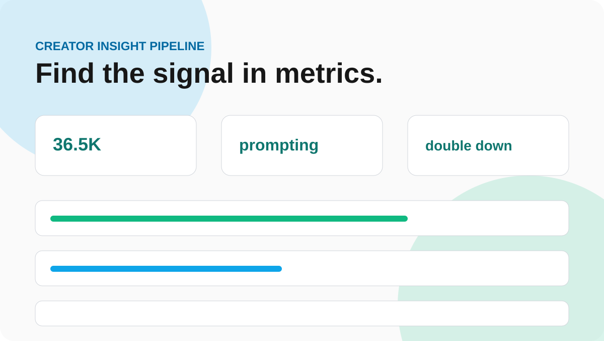

<div align="center">

# Creator Insight Pipeline


Content analytics that turns numbers into the next move.

</div>

Complexity: **Level 3**

Creator Insight Pipeline analyzes content performance and recommends what to publish next.



## Demo

Open `public/index.html` for a visual insight dashboard, or run the CLI example below.

## Live Demo

`https://abdulazizbalu.github.io/creator-insight-pipeline/`

## Case Study

**Problem:** view count alone does not explain what content is worth repeating.

**Solution:** calculate engagement signal from saves and shares, identify the strongest topic, and recommend the next strategic move.

**What it shows:** analytics thinking, content strategy, and clean data transformation logic.

## Why It Fits My Profile

- Digital Media Strategist: turns metrics into decisions
- Full-Stack Developer: clean data processing modules
- AI Specialist: can feed briefs into an AI content assistant

## Example

```bash
node projects/creator-insight-pipeline/src/analyze.js
```

## Test

```bash
npm test
```
